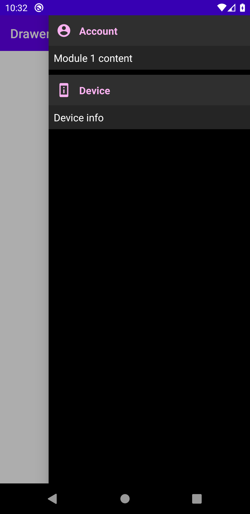

# ComposeDrawer

Composable Debug Drawer for Jetpack Compose apps



## Install

Configure jitpack:

```gradle
allprojects {
  repositories {
    ...
    maven { url 'https://jitpack.io' }
  }
}
```

Add dependencies:

```gradle
implementation 'com.github.alorma.ComposeDrawer:drawer-base:v0.0.1-alpha-01'
implementation 'com.github.alorma.ComposeDrawer:drawer-modules:v0.0.1-alpha-01'
```

## Setup

Wrap your content with `DebugDrawerLayout`:

```gradle {
DebugDrawerLayout(
  debug = { BuildConfig.DEBUG },
  drawerModules = {
    ...
  }
)
```

## Modules

> This library does not provide any usable module yet.

You can create your own module by creating a class that extends: `DrawerModule`

```kotlin
class DeviceModule : DebugModule {
    override val icon: IconType
    override val title: String = 

    @Composable
    override fun build() {
        ...
    }
}
```
